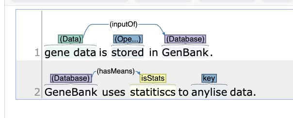

This file converts Inception WebAnno xmi 1.1 formats to json or CONLL-2003 file format.

This script focus on handing **custom layers** of annotation (where all the annotation layers are custom)

To find out if your annotations are in the `custom layers` check if all annotations are in lines that starts with `<custom` in the xmi file. 
for example:
```xml
<custom:Database xmi:id="228" sofa="1" begin="32" end="40"/>
    <custom2:InputOf xmi:id="222" sofa="1" begin="23" end="30" Dependent="217" Governor="211"/>
```

This package can be simply run on python3.8. 

We have provided a test.xmi file and the annotation looks like . The example outputs are in 

To run the programs.
> python xmi2json xmi_filePath
> python xmi2conll xmi_filePath:
